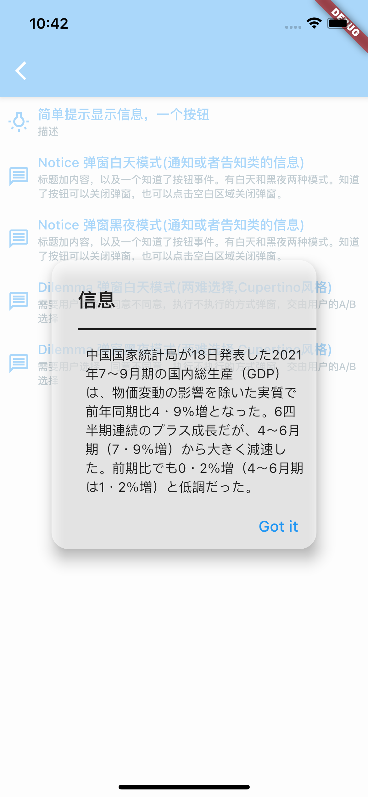

Dialog Model
=======

> notice  (消息提示类型弹窗)

[comment]: <> (![]&#40;images/dialog_notice_bright.png&#41;{:height="30%" width="30%"}![]&#40;images/dialog_notice_dark.png&#41;{:height="30%" width="30%"})

> dilemma (条件选择类型弹窗)